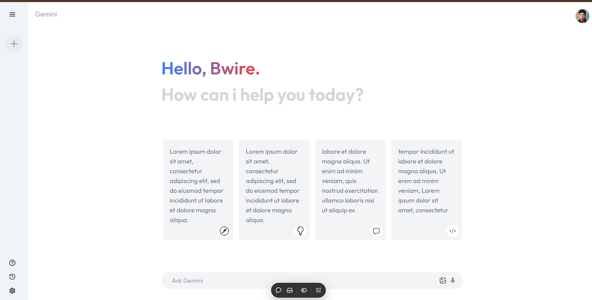
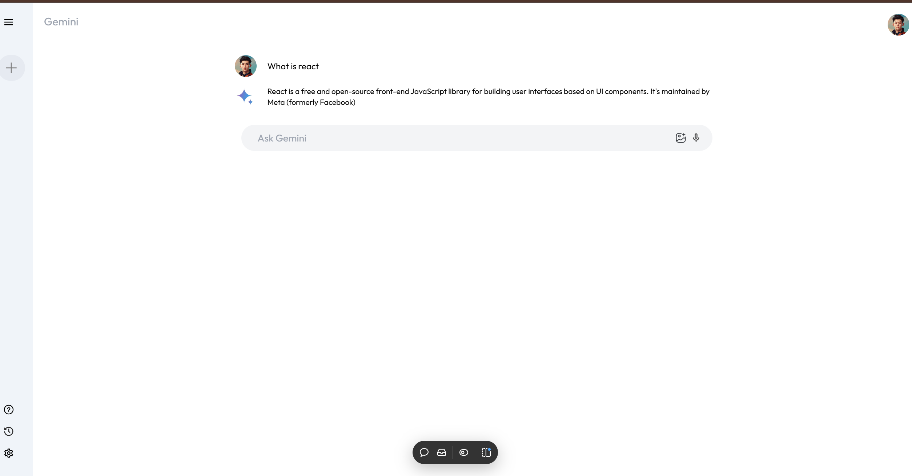
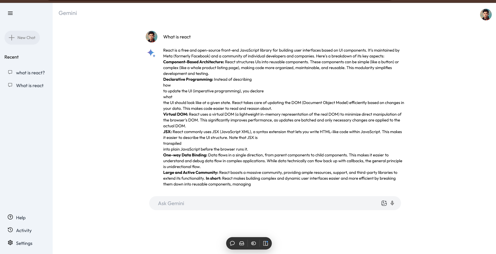

# Gemini Clone 🌟

A feature-rich Gemini clone built with React to deliver a sleek and functional web app experience.

## Live Preview: https://gemini-clone-green-xi.vercel.app/

## Features

- **Modern UI/UX**: Styled to mirror Gemini's clean and intuitive design.
- **Interactive Components**: Smooth interactions powered by React.
- **Optimized Performance**: Built with efficiency and responsiveness in mind.

## Tech Stack

- **React**: Frontend framework for building dynamic interfaces.
- **JavaScript**: Core programming language.
- **CSS/SCSS**: Styling for visual aesthetics.

## Installation and Setup

1. **Clone the repository**

   ```bash
   git clone https://github.com/your-username/gemini-clone.git
   cd gemini-clone
   ```

2. **Install dependencies**

   ```bash
   npm install
   ```

3. **Start the development server**

   ```bash
   npm run dev
   ```

4. Open [the localhost] in your browser to view the app.

## Live Demo

https://gemini-clone-green-xi.vercel.app/

## Screenshots

_Add screenshots or GIFs of your project here to showcase its design and functionality._




## Contributing

Contributions are welcome! Feel free to submit issues or pull requests.

## License

This project is licensed under the [MIT License](LICENSE).

---
